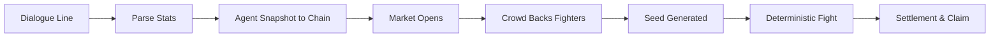

# ⚔️ ENTITY NEXUS

> **Cast a line of film dialogue. Watch it fight. Bet on someone else's.**


ENTITY NEXUS is an innovative, deterministic 2D fighting game powered by cinematic dialogue and settled on the blockchain. Pick a line from the **Dialogue Vault** (spanning Hindi, English, Tamil, Telugu, and Korean cinema), and the game's parser transforms that line into combat stats. 

Those numbers drive a **deterministic 60 FPS fight**, and the crowd backs a side using real MON on the **Monad Testnet**. No controllers. Nobody touches a key once the bell rings.

Live on **Monad Testnet** (chain `10143`):
- 🏟️ **ArenaBattle:** [`0x0329D1A516e9F5f8a89B48C4AD0515884f0652a5`](https://testnet.monadexplorer.com/address/0x0329D1A516e9F5f8a89B48C4AD0515884f0652a5)
- 🎴 **FighterNFT:** [`0xD12205ea18E336F2a4995Cc0Ef6226efaC48639F`](https://testnet.monadexplorer.com/address/0xD12205ea18E336F2a4995Cc0Ef6226efaC48639F)
- ⚖️ **Arbiter:** `0x1F9326384C92d29915fd4EDD22797C3E664Dc651`

---

## ✨ Key Features

- **🗣️ Dialogue-Driven Combat:** Inputs are film dialogue lines. Gemini AI (or a fallback offline lexicon) interprets the intent and converts it into unique combat stats (ATK, DEF, SPD).
- **🕹️ Pure Deterministic Engine:** Custom 2D canvas simulation running at a fixed 60 FPS. The fight is a pure function: `(statsA, statsB, seed, playbooks) → identical knockout`.
- **💰 Pari-Mutuel Betting on Monad:** Real on-chain betting using MON. Payouts are trustless and distributed based on the winning pool size.
- **⚡ Zero Build Step:** No React, no Tailwind at runtime, no bundlers. Written in plain HTML, CSS, and classic JS. It's incredibly fast, robust, and impossible to fail to hydrate.
- **🛡️ Server-Side Verification:** The Node.js server runs the exact browser engine unmodified in a `vm` to guarantee the results and sign the settlement.
- **🖼️ Fully On-Chain NFTs:** Fighter NFTs render their own SVG cards via base64 JSON directly from the contract. No IPFS or external URLs to rot.

---

## 🚀 Getting Started

**Live Demo:** [https://entitynexus.onrender.com](https://entitynexus.onrender.com) *(Render free tier — may take a few seconds to cold-start)*

### Local Setup

Because the tech stack is deliberately small, getting up and running takes seconds.

```bash
# Clone the repository
git clone https://github.com/ajayXcode/ENTITY-NEXUS.git
cd ENTITY-NEXUS

# Install the only dependency (ethers)
npm install

# Start the local server
npm start
```

Visit `http://localhost:8080` to play.

### Testing

Run the test suites (zero testing framework dependencies):
```bash
npm test
```

---

## 🏗️ Architecture & Tech Stack

Every architectural choice was made to remove moving parts between the player and the fight. 

| Component | Technology | Why? |
| :--- | :--- | :--- |
| **Server** | Node >= 18 (`node:http`, `node:vm`) | One process, no framework. `server.js` boots instantly. |
| **Blockchain** | `ethers ^6.17` | The only runtime dependency. |
| **Front-End** | HTML + CSS + ES5 JS | Zero build tools. Guaranteed to run everywhere. |
| **Simulation** | Custom 2D Engine (Canvas) | Deterministic fighting engine built from scratch. |
| **Determinism** | `mulberry32` PRNG | 32-bit seeded PRNG guarantees every fight is reproducible. |
| **Contracts** | Solidity 0.8.24 (Cancun) | Deployed on Monad Testnet for high-performance execution. |

---

## 🗺️ How a Match Works



1. **Line → Stats:** The engine reads intent. For example, *"I'd rather run than trade hits"* yields low aggression and high speed.
2. **On-Chain Commitment:** Lines are hashed to the chain before money moves.
3. **Betting & Seeding:** The arbiter commits to a seed. The crowd places bets. The seed is finalized using the close blockhash.
4. **The Fight:** The deterministic engine runs using the seed. 
5. **Settlement:** Winnings are calculated pari-mutuel style and claimed.

---

## 📁 Repository Layout

```text
├── server.js              # Core backend: static server, API, relay, stat engine
├── arbiter.js             # EIP-712 settlement signer
├── house/                 # Server-side matching & headless simulation
│   ├── market.js          # Match lifecycle (open → seed → settle)
│   └── sim.js             # Headless browser engine runner
├── js/                    # Front-end logic (No build step)
│   ├── dialogues.js       # The Dialogue Vault
│   ├── game.js            # Core deterministic engine
│   └── blockchain.js      # Monad Testnet interaction
├── contracts/             # Solidity smart contracts
├── assets/                # Generated SVGs and sprites
└── *.css / *.html         # Hand-written pages and styling
```

---

## 📜 Environment Variables

To run the full suite with the Gemini parser and Arbiter features:

```bash
GEMINI_API_KEY_1=...                      # For the stats engine
ARBITER_PRIVATE_KEY=0x...                 # 64 hex chars (Settlement signer)
MONAD_RPC=https://testnet-rpc.monad.xyz   # Optional (Default testnet RPC)
HOUSE_CHAIN_TABLES=2                      # Matches settled on chain
HOUSE_FLOOR=on                            # Enables the house floor
```

> **Note:** The arbiter address must match the `ArenaBattle` contract's arbiter or settlements will be rejected. 

---

Built for **Monad Testnet**.
